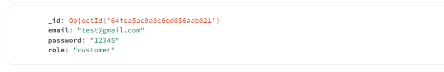
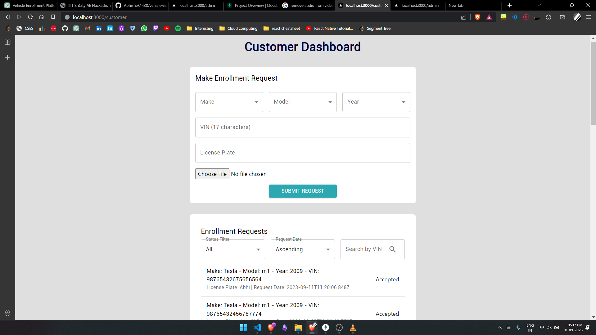
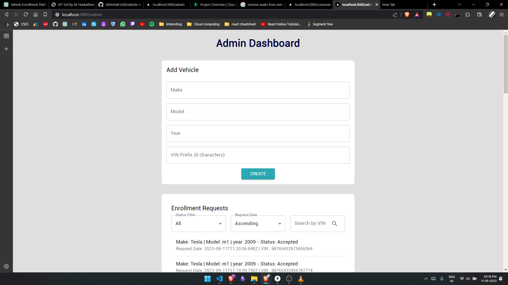
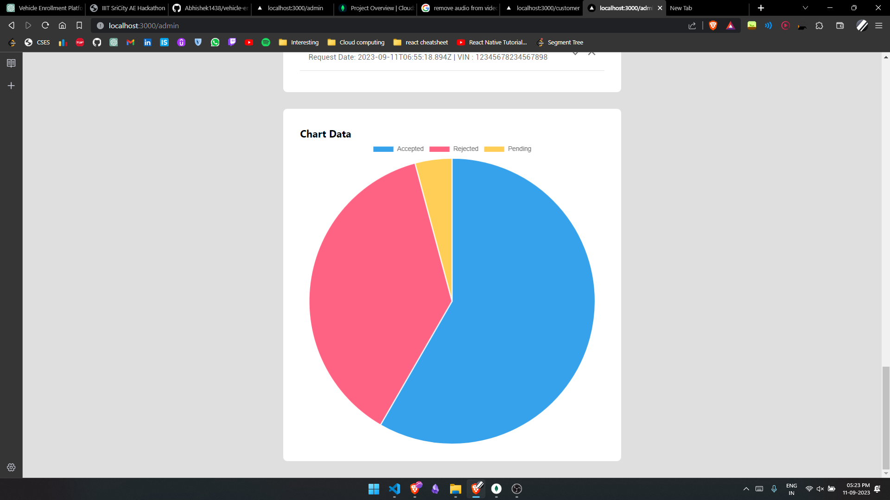

# Name : Abhishek Manithia

# Roll No : S20210010004

# Tech Stack used : Next, Mongodb, Node, Express.

# Video link: https://drive.google.com/file/d/1pMEOhnK5L2KheKPTqqjPjYQe9ylR_F7Q/view?usp=sharing

INSTRUCTIONS TO RUN THE CODE

1. make sure you have node,mongodb installed.
2. Local mongodb server is used so insert the user data in the collection.
3. cd to express-backend run node app or nodemon app if you have nodemon installed.
4. cd to client and run npm run dev.
5. go to browser and open http://localhost:3000/ and try the website.

 example data.

